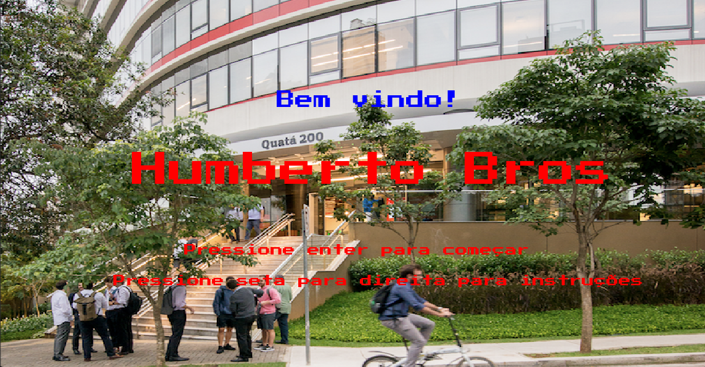

HUMBERTO BROS

FOTO DO HUMBERTO NO JOGO AQUI

Remake do jogo de plataforma Mario Bros utilizando o professor de DesSoft Humberto, o jogo retrata o cotidiano do professor e seus desafios para enfrentar um dia na firma da faculdade.
O objetivo do jogo é concluir todas as tarefas do dia sem ser pego pelos alunos, além de conseguir tomar um café no final de cada fase, conseguindo passar por todas as etapas de um dia cansativo na firma.

COMO JOGAR:
Na tela inicial, se pressionado seta para a direita, há uma tela de instruções e simulação antes do começo do jogo.

VIDEO DE EXPLICAÇÃO E DEMONSTRAÇÃO DO JOGO:
https://youtu.be/ezXszNT_y5c

Para jogar, basta possuir o pygame instalado no seu diretório e executar o arquivo "main". Bom jogo!

Criadores:
Lucca Niklaus
Mariana Rosa
Stefane Rodrigues

Créditos:
efeitos sonoros:https://www.youtube.com/watch?v=EDBhKDuEMoM
Trilha sonora:https://www.youtube.com/watch?v=mdFrn89x74k